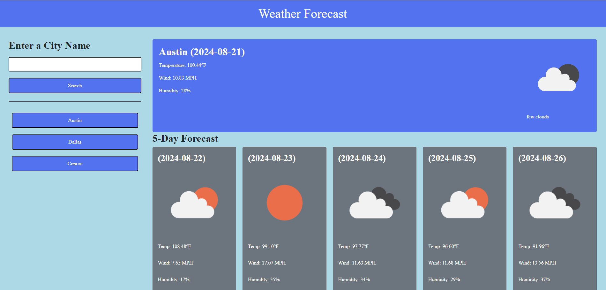

# Weather-Forecast

A simple weather application that will help you identify what the forecast will be at the current time and the next upcoming days. You will be able to put in a city name to easily find the weather. All the cities will be saved on the page for quick access to a previously searched city. The page will dynamically update based on what city you put.

Screenshots:

Links:

Github Repository Link: https://github.com/JPhanvilay/Weather-Forecast

Deployed Link:
